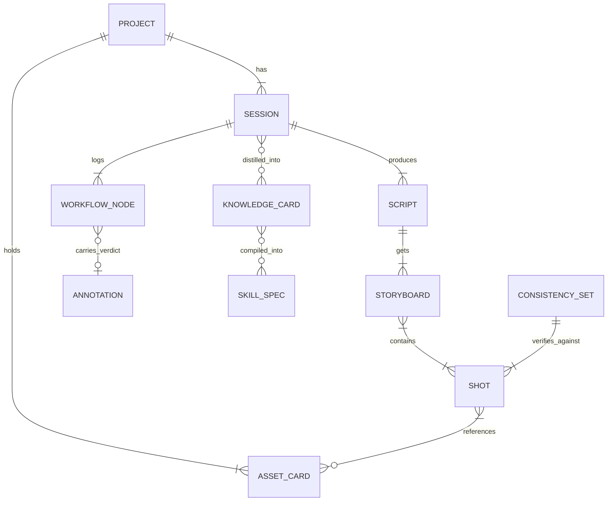
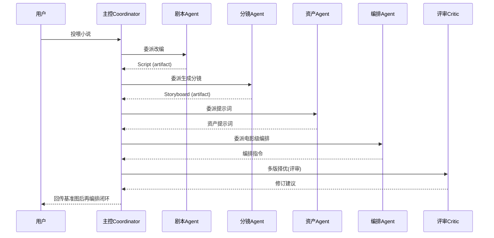

# 影视编导策划智能体 · 总汇终版技术文档

> **文档版本**：V2.0（终版）　**编制日期**：2026-09-21　**文档状态**：方案终审定稿（进入实现）
> **本版相较 V1.0 的变更**：融合了《行业对齐验证评估报告》的结论与改良建议（P0–P2），对「Agent 编排底座」「MCP 扩展」「一致性评估」「界面埋点」「冷启动训练」五处做了针对性修订，并新增「行业对齐与落地路径」章节。全文为唯一权威技术基线。

---

## 目录

- [1. 文档说明](#1-文档说明)
- [2. 产品愿景与定位](#2-产品愿景与定位)
- [3. 可行性结论与开源对标](#3-可行性结论与开源对标)
- [4. 产品功能总览](#4-产品功能总览)
- [5. 系统总体架构（终版）](#5-系统总体架构终版)
- [6. 技术选型](#6-技术选型)
- [7. 核心数据模型与关系图](#7-核心数据模型与关系图)
- [8. 多 Agent 工作流编排（终版）](#8-多-agent-工作流编排终版)
- [9. 外部 API 与 MCP 接入层](#9-外部-api-与-mcp-接入层)
- [10. 能力提升与训练闭环（含冷启动与埋点）](#10-能力提升与训练闭环)
- [11. 桌面端 UI/UX 设计](#11-桌面端-uiux-设计)
- [12. 复盘沉淀功能](#12-复盘沉淀功能)
- [13. 一致性评估与质量回归（新增）](#13-一致性评估与质量回归新增)
- [14. 行业对齐与落地路径（新增/终版）](#14-行业对齐与落地路径新增终版)
- [15. 代码开发规范](#15-代码开发规范)
- [16. 推荐项目结构（终版）](#16-推荐项目结构终版)
- [17. 开发里程碑（终版）](#17-开发里程碑终版)
- [18. 风险与对策（终版）](#18-风险与对策终版)
- [附录 A · 设计图稿索引](#附录-a--设计图稿索引)
- [附录 B · 与 V1.0 的变更对照](#附录-b--与-v10-的变更对照)

---

## 1. 文档说明

### 1.1 文档地位
本总汇终版（V2.0）是项目的唯一权威技术基线，整合了：
- 《开发可行性分析评估报告》
- 《类似 Codex 桌面应用评估报告》
- 《桌面应用技术架构设计图》《布局工程图》《复盘沉淀工程图》《交互原型》
- 《复盘沉淀功能技术方案》
- 《行业对齐验证评估报告》及其改良建议（P0–P2）

### 1.2 符号约定
- `代码`：标识符 / Schema 字段。
- 🧩：设计决策。　⚠️：风险或需注意点。
- 【P0/P1/P2】：改良建议的落地优先级（P0 最优先）。

---

## 2. 产品愿景与定位

### 2.1 一句话定位
一款**只做「导演与策划智慧」的智能体**：把小说改编成剧本、剧本拆成分镜、分镜推导**精确生图/生视频提示词**，并将基准图回传完成**电影级分镜编排**；以桌面化对话工作台交付，通过评审复盘与可投喂训练持续进化。

### 2.2 核心差异化（终版明确）
1. **聚焦"策划层"，不做通用渲染器**（生图/生视频外包）。
2. **更强的专业壁垒**：能产出行内认可的镜头语汇、越轴修正、叙事节奏。
3. **模型无关**：全部生成能力走外部 API，利于私有化与快速迭代。

> 🧩 终版新增原则：**编排复用成熟 Agent SDK 底座，自研重心放在"分镜/资产/评审"的专科 prompt 与工具上**，不自建重型 loop 调度（依据行业对齐结论，见 14 章）。

---

## 3. 可行性结论与开源对标

### 3.1 可行性结论（终版维持）
| 能力 | 成熟度 | 落点 |
|------|--------|------|
| 剧本改编 | ✅ 成熟 | 双阶段解耦；剧本 Schema |
| 分镜脚本 | ✅ 成熟偏半 | 分镜 JSON + 领域知识库 |
| 资产提示词推导 | ✅ 成熟（差异化） | 精确提示词，不生成图 |
| 基准图回传→再编排 | ✅ 成熟 | IP-Adapter/ControlNet/Qwen 参考图 |
| 电影级编排 | ⚠️ 半成熟 | 编排知识库 + 镜头语汇提示词，需人工把关 |
| 持续训练自进化 | ✅ 可行（须受控） | RAG 即时层 + 定期微调 + 【P1】数据飞轮埋点 |

### 3.2 开源生态对标
| 项目 | 方向 | 可复用能力 |
|------|------|-----------|
| ArcReel（4.2k★） | AI 短剧工作台 | 6 阶段 Agent、角色/场景/道具资产库、多供应商协议 |
| Story Claw | 小说→分镜 | 分镜 `panels_*.json` 结构 |
| ViMax（1万+★） | 想法→成片 | 5 Agent 编排、RAG、Quality Control Agent |
| ScripterAgent（腾讯） | 对话→剧本 | Director/Critic、两阶段训练 |
| Cline（68.1k★, 11M+） | 开源 coding agent | 桌面原生、SDK 嵌入、多模型、MCP、Skills（本方案底座参考） |

---

## 4. 产品功能总览

| 模块 | 能力 | 交付物 |
|------|------|--------|
| 剧本改编 | 小说→分场剧本 | 结构化剧本 |
| 分镜脚本 | 剧本→镜头列表 | 分镜 JSON |
| 提示词推导 | 分镜→精确提示词 | 角色/场景/道具/服饰文本提示词 |
| 分镜编排 | →电影级分镜 | 构图/景别/运镜/色彩/叙事/配音指令 |
| 评审 / 迭代 | Critic 择优+修订 | 修订建议 + 基准图一致性复核 |
| 复盘沉淀 | 对话→知识→Skill | 知识卡片 + Skill 封装 + 复用闭环 |
| **采纳埋点【P1】** | 对话内 Accept/Reject+理由 | 训练数据飞轮样本 |

---

## 5. 系统总体架构（终版）

### 5.1 架构分层图（终版，含 SDK 底座与 MCP）
```
┌─────────────────────────────────────────────────────────────┐
│ ① 表现层（桌面 UI · Tauri2 + 系统WebView + React/TS）        │
│   ├─ 对话窗口   ├─ 分镜工作台   ├─ 资产·基准图区             │
│   └─ 复盘沉淀中心（独立窗口） + 【P1】采纳埋点按钮(✓Approved/✗Rejected/?) │
├─────────────────────────────────────────────────────────────┤
│ ② Agent 核心（本地 Rust 服务层）                            │
│   ├─ 复用成熟 Agent SDK/编排底座（不自建重型 loop）【P0】    │
│   ├─ 多 Agent 专科提示词 + 工具：剧本/分镜/资产/编排/评审    │
│   ├─ 工具沙箱：tool-call · 上下文管理（session thread）      │
│   ├─ WorkflowNode 结构化 artifact + 埋点日志落库            │
├─────────────────────────────────────────────────────────────┤
│ ③ 工具与数据层（本地可调）                                   │
│   ├─ Schema 读写校验 · SQLite 持久化                        │
│   └─ 向量库（本地）+ 资产图库 + 【P1】一致性评估基准库       │
├─────────────────────────────────────────────────────────────┤
│ ④ 接入层（供应商适配 + MCP）                                │
│   ├─ 国内 LLM / 生图 / 生视频 / TTS（可插拔，本地 vLLM/Ollama）│
│   └─ 【P0】MCP 服务器接入（音效库/资产平台/第三方工具）      │
└─────────────────────────────────────────────────────────────┘
   数据飞轮：采纳埋点 → 复审归档 → 定期微调 → 一致性Evals回归 → 受控迭代
```

### 5.2 终版关键设计决策
| 决策 | 说明 |
|------|------|
| 🧩【P0】编排底座复用 | 不重写 loop/上下文切割，复用 Claude Agent SDK / Cline SDK / 国内 LLM 的 agent SDK |
| 🧩【P0】自研重心 | 聚焦分镜/资产/评审的**专科 prompt + 专科工具** |
| 🧩【P1】采纳埋点 | 对话即训：Accept/Reject/Unknown 三元 + 理由，落 `WorkflowNode` |
| 🧩【P1】一致性可度量 | 建立一致性评估基准库 vs 质量回归 |
| 🧩【P2】评审低成本 | 评审子代理用轻快/低成本模型 |

---

## 6. 技术选型

### 6.1 桌面壳选型
| 方案 | 安装包 | 内存(6窗口) | 后端 | 结论 |
|------|--------|------------|------|------|
| **Tauri 2（推荐）** | 8.6MB | ~172MB | Rust，安全隔离 | 轻量、可私有化、承载工具层 |
| Electron | 244MB | ~409MB | Node | 重，不适用轻量 agent |
| Python GUI | 大/中 | 高 | Python | 跨端分发弱 |

### 6.2 前端栈
React + Vite（TS 严格模式）；状态 Zustand；分镜时间轴自定义 Canvas 或 `react-zoom-pan-pinch`。

### 6.3 后端 / Agent 栈（终版）
- **Rust 服务层**（Tauri 命令）+ 可选 tokio。
- **Agent 编排**：复用成熟 Agent SDK 底座（见 5.2），不重写 loop。
- 🧩【P0】通过 SDK 的 coordinator 机制声明 "roster" 子代理（剧本/分镜/资产/编排/评审），各自独立 session thread。

### 6.4 LLM / 向量 / 微调
- LLM：通义 / 豆包 / DeepSeek / Kimi。
- 向量：`sqlite-vec` / `lance`，大规模 Qdrant。
- 嵌入：`text-embedding-v3` / `BGE-M3`，多模态 CLIP。
- 微调：LlamaFactory / Unsloth / Axolotl（LoRA/QLoRA + SFT/DPO/GRPO）。

---

## 7. 核心数据模型与关系图

### 7.1 领域核心概念（终版）
剧本 / 分镜 / 资产卡 / WorkflowNode / 知识卡片 / SkillSpec，另新增：**采纳埋点样本（annotation）** 与 **一致性回归基准（consistency_set）**。

### 7.2 ER 关系示意


### 7.3 关键实体 Schema

**剧本片段**
```jsonc
{ "script_id":"sc_001","title":"夜航","scenes":[
  { "scene_no":3,"location":"船舱甲板","time":"夜",
    "beats":[{"type":"action|dialogue","speaker":"船长","text":"…","emotion":"压抑"}],
    "intent":"揭示船长内心的动摇" } ] }
```
**镜头**
```jsonc
{ "shot_id":"st_0302","scene":3,"goal":"渲染孤寂","shot_type":"over_shoulder",
  "camera":{"height":"eye","move":"dolly-in","lens":"50mm"},
  "composition":"三分法，主体右1/3","color":"冷蓝+暖高光","narrative":"慢节奏",
  "voice":"小型弦乐铺底" }
```
**WorkflowNode（含埋点）【P1】**
```jsonc
{ "node_id":"wf_8f2c1a","session_id":"sess_0312","type":"tool_call",
  "agent":"storyboard_agent","tool":"storyboard_updater","args_snapshot":{"scene":3},
  "produced_artifacts":["art_ff1"],"result_status":"applied",
  "verdict":{"label":"accepted","reason":"情绪切分更清晰","reviewer":"human|critic"}, "ts":1752120000000 }
```
> 【P1】`verdict` 三元：`accepted` / `rejected` / `unknown`，携带 `reason`，是数据飞轮的核心样本源。

**KnowledgeCard / SkillSpec** —— 见第 12 章。

---

## 8. 多 Agent 工作流编排（终版）

### 8.1 Agent 清单（Actor / Critic，终版）
| Agent | 角色 | 输入 | 输出 | 模型层级建议 |
|-------|------|------|------|--------------|
| 主控 Draft | 任务分发 | 用户意图 | 调度计划 | 强模型 |
| 剧本改编 Agent | 小说→剧本 | 原文 | Script | 中/强 |
| 分镜脚本 Agent | 剧本→镜头 | Script | Storyboard | 中 |
| 资产提示词 Agent | 提示词推导 | 剧本/镜头 | 资产提示词 | 中 |
| 分镜编排 Agent | 电影级编排 | 分镜+资产 | 全维编排指令 | 强 |
| **评审 Critic Agent【P2】** | 择优+修订 | 多版分镜 | 评分+可落地修订建议 | **轻快/低成本模型** |
| 配音音效顾问 Agent | 音效设计 | 分镜 | 对白节奏/音效/配乐指令 | 轻快 |

> 🧩 依据 orchestrator-worker：**规划/编排用强模型，评审与专科 worker 用弱/快模型**，降本提速。

### 8.2 主链路编排（终版，SDK coordinator + 结构化 artifact）

> 通过 SDK coordinator 的 roster/子代理 + session thread 实现（复用底座，见 5.2）。

### 8.3 一致性策略（防"角色精分"）
1. 资产库先行：先建三类资产卡，全部分镜基于资产卡生成。
2. 参考图条件控制：IP-Adapter / ControlNet / StoryMaker / LoRA。
3. 上下文管理：事件→场景→镜头三级分解 + RAG 全局语境（ViMax 验证）。

---

## 9. 外部 API 与 MCP 接入层

### 9.1 生成能力供应商
| 能力 | 可选供应方 |
|------|-----------|
| LLM | 通义 / 豆包 / DeepSeek / Kimi（OpenAI 兼容或各家 SDK） |
| 生图 | Seedream / 通义万相 / FLUX / GPT-Image |
| 生视频 | Seedance / 可灵 / Vidu / Sora / Veo |
| TTS | 各家云 TTS |

### 9.2 协议抽象
供应商协议 + 自定义端点 + 本地 `Ollama`/`vLLM`。Agent 只按语义选能力，不绑定厂商（对齐 Cline "任意/OpenAI兼容 endpoint + bring your own key"）。

### 9.3 【P0】MCP 接入（本版新增）
- 通过 MCP 服务器接入第三方能力：音效库、资产平台、剪辑 API、素材检索等。
- 子代理可挂不同 MCP（对齐 Managed Agents "各自独立配置 MCP" 的设计）。
- 示例：评审子代理挂 `assets-mcp` 做基准图一致性校验、`sfx-mcp` 做音效匹配。

### 9.4 接入规范
- 凭证存 OS Keychain，仅 Rust 侧透传，不入渲染层。
- 统一错误码与降级提示（限流/欠费/网络）；【P2】生成结果本地落资产库缓存的复用策略。

---

## 10. 能力提升与训练闭环

### 10.1 三层递进机制
| 层次 | 机制 | 作用 | 迭代速度 |
|------|------|------|---------|
| 短期·记忆层 | 评审结果+采纳样本进向量库(RAG) | 零样本沉淀偏好/范式/规避点 | 即时生效 |
| 中期·权重层 | LoRA/QLoRA + SFT/DPO 定期重训 | 记忆升级为内化能力 | 按版本触发 |
| 长期·规范层 | Schema 版本 + 提示词库 + 评审清单 | 三处同源演进 | 版本化发布 |

### 10.2 【P1】数据飞轮埋点（对齐 AITL / MAPE，本版核心改良）
在对话与评审界面**直接埋点采集 4 类信号**，而非等离线批量标注：
1. **成对偏好**（两版评审哪个更好）。
2. **采纳决策 + 理由**（`keyword.verdict`，本版 `WorkflowNode` 已承载）。
3. **知识相关度**（资产/镜头是否命中知识库）。
4. **缺失知识**（评审发现知识库没有的规则）。

> 对齐 Airbnb AITL：模型更新周期从"月"缩短到"周"；对齐 NVIDIA MAPE：监控→分析→规划→执行闭环。

### 10.3 受控边界（防漂移）
1. 不做无监督实时自训；改"定期采集→人工抽样把关→批量重训→回归评测"。
2. 评审者也被评审：元评审 / Evals 回归集（含一致性维度，见 13 章）。
3. 评审不只打分：Critic 输出**可落地修订指令**。
4. 采纳闭环为数据：Accept/Reject/Unknown 三元是最干净标签源。

### 10.4 【P1】冷启动训练策略（本版新增）
早期真实采纳样本稀疏，采用 **"合成+人工把关"** 过渡（对齐 NVIDIA synthetic data）：
- 先用合成分镜对（LLM 生成 + schema 约束）配合人工抽样修正，积累首批训练集。
- 随埋点增加逐步切换到真实采纳样本，并做分布漂移监测。

---

## 11. 桌面端 UI/UX 设计

### 11.1 定位
「类似 Codex 的桌面 agent 应用」：本地文件/资产、可后台重任务、可视化分镜画布、支持拖拽文件与图片上传。

### 11.2 整体布局（左中右三位一体 + 底部工具流）
```
┌─────────────────────────────────────────────────────────────┐
│ 顶栏：品牌·项目·模型供应商·账户                               │
├────────┬──────────────────────────┬─────────────────────────┤
│ 左W250 │ 中栏（弹性）             │ 右W392(可拖宽)           │
│七步导航│ 对话窗口                 │ 影视工作台               │
│①剧本  │ ·工具流式回显             │ ·分镜画布(时间轴)        │
│②分镜  │ ·输入条[拖拽文件/图片]    │ ·镜头卡 / 资产卡/基准图    │
│③提示词│ ·[P1]采纳按钮(✓/✗/?)      │ ┌─底部工具流Dock────────┐│
│④编排  │ │                        │ │资产|镜头|编排|评审|配音││
│⑤配音  │ │                        │ └──────────────────────┘│
│⑥评审  │ │                        │                          │
│会话集合│ │                        │                          │
│·设置·沉淀                            │
└───────┴──────────────────────────┴─────────────────────────┘
  复盘沉淀中心入口（独立窗口）
```
> 【P1】中栏每条关键工具结果旁增加 **Accept/Reject/Unknown** 三态埋点按钮（默认 Unknown），这是数据飞轮的 UI 载体。

### 11.3 已交付设计稿
1. 布局工程图（左中右线框稿 + 区域编号表）。
2. 复盘沉淀中心工程图（独立窗口，STEP01→02→03）。
3. 复盘沉淀中心交互原型（可操作高保真，含切换/沉淀/封装/Toast）。

### 11.4 视觉基调
深色石墨底 + 胶片琥珀 + 克制品牌紫，走"专业影视/剪辑台"观感。

### 11.5 待确认设计决策
1. 深浅色基调；2. Dock 位置；3. 左栏是否可折叠。

---

## 12. 复盘沉淀功能

### 12.1 功能定位
`对话记录 → 知识卡片(多技能点) → 工作流知识库 → 一键封装 Skill → 会话复用`

### 12.2 关键数据模型

**KnowledgeCard**
```jsonc
{ "card_id":"kc_09","skill_point":"分镜脚本优化","origin":{"sessions":["sess_0312"]},
  "trigger":"分镜需按情绪拆分","interface":{"inputs":["剧本段落","分镜JSON"]},
  "steps":[{"order":1,"action":"解析剧本段落","tool":"解析器"}],
  "prompt_template":"按 铺垫/冲突/释放 三段切分……",
  "best_practices":["情绪转折点拍慢"],
  "metrics":{"consistency_stability":"3/3","reuse_count":0},"state":"drafted" }
```
**SkillSpec**
```jsonc
{ "skill":{"name":"storyboard-optimize","description":"……","version":"1.0.0",
  "source_cardId":"kc_09","workflow":[{"step":"parse","agent":"script_parser"}],
  "entry_trigger":"/workflow:storyboard-optimize","prompts":{"template":"…","variables":["分镜JSON"]} } }
```

### 12.3 四步管线
| 阶段 | 处理 |
|------|------|
| PHASE1 总结 | 还原 WorkflowNode 序列 → LLM 归纳操作流程/工具链/产物 |
| PHASE2 提炼 | 按技能点拆分为 n 张 KnowledgeCard（schema 约束，人工可编辑） |
| PHASE3 沉淀 | 向量入库 + SQLite + 样本归档 |
| PHASE4 封装 | 回归达标或人工确认 → 编译 SkillSpec → skills/ 目录，会话内一键调用 |

### 12.4 库检索与淘汰
hybrid(BM25+向量)；复用入口 `/workflow:<skill>`；`reuse_count` 淘汰低效卡。

### 12.5 集成
Skill 复用 → 新一轮 WorkflowNode → 再复盘 → 能力增强引擎。

---

## 13. 一致性评估与质量回归（新增）

> 目标：为"角色/场景/道具跨镜头一致性"与"电影级编排质量"定义**可度量、可回归**的标准，融入 Evals，防止胃标与评审漂移。

### 13.1 一致性评估维度
| 维度 | 说明 | 度量方式 |
|------|------|---------|
| 角色一致性 | 同一角色外貌/服饰/形体重跨镜头稳定 | LLM 打分 + 抽样人审 + 图像 embedding 相似度(cos) |
| 场景一致性 | 同一场景风格/光源/构图连续 | 同上 |
| 道具一致性 | 道具形态/位置一致 | 同上 |
| 提示词可复现性 | 同一提示词多次出图稳定 | IC50/相似度分布 |

### 13.2 质量回归集（Evals）
- 固定剧本→分镜→提示词→编排的黄金用例集。
- 每次微调/封装前必须通过回归，未通过不得发 Skill。
- 评分含：结构正确性、一致性得分、Prompt 可用性、编排专业度（含越轴/景别/色彩规则）。

### 13.3 落地
- 入库为 `consistency_set` 基准库（第 7 章 ER 已加）。
- 与采用埋点并行：`accepted` 样本作为一致性高质样本优先采纳。

---

## 14. 行业对齐与落地路径（新增/终版）

> 本节固化《行业对齐验证评估报告》结论，作为落地红线。

### 14.1 关键验证结论
| 验证点 | 结论 | 依据 |
|--------|------|------|
| 桌面 agent 原装（对话+工具+文件） | ✅ 成立 | Claude Code、Cline(68.1k★,11M+)，Cline 已有桌面原生 |
| 多智能体编排（协调器+专科子代理） | ✅ 业界主线 | Anthropic Managed Agents `multiagent`；orchestrator-worker +90.2% |
| 评审/批判子代理 | ✅ 业界推荐 | Anthropic Planner-Generator-Evaluator；Cline Plan→Act |
| 自我改进/投喂训练 | ✅ 必须按数据飞轮 | Airbnb AITL；NVIDIA MAPE；容智 L4 反思循环 |
| 外部 API 可插拔 + MCP | ✅ 成立 | Cline 任意/OpenAI兼容 endpoint + MCP |
| MCP 接入 | ✅ 需补上 | Cline/Claude Code 标配 |

### 14.2 落地路径修正（P0–P2）
| 优先级 | 落地动作 |
|--------|---------|
| **P0** | 编排复用成熟 Agent SDK 底座（不自建重型 loop），自研重心在"分镜/资产/评审"专科能力；原生接入 MCP |
| **P1** | 对话界面采纳埋点(✓/✗/?)；一致性可度量并纳入 Evals；冷启动用合成分镜对+人工把关 |
| **P2** | 评审子代理用轻快模型降本；`WorkflowNode` 对齐结构化 artifact + 埋点 schema；补版权/供应商降级/缓存 |

---

## 15. 代码开发规范

### 15.1 语言与命名
前端 TS 严格；后端 Rust(edition 2021)。TS `camelCase`/组件 `PascalCase`/常量 `UPPER_SNAKE`；Rust `PascalCase`/`snake_case`/`SCREAMING_SNAKE`。

### 15.2 目录
前端 `src/{components,features,services,state,assets}`；Rust `src-tauri/{commands,agents,repo,providers,sandbox,errors}`。

### 15.3 注释 / Git / 安全
- 注释解释"为什么"；API 用 JSDoc/Rustdoc。
- Git：`feat/*`、`fix/*`、`docs/*`；conventional commits（`feat:`/`fix:`/`docs:`/`refactor:`）。
- Rust 处理文件/网络/凭证；凭证仅 OS Keychain；外部输入 schema 校验后再进 Agent 上下文。
- 【P1】所有 tool-call 落 `WorkflowNode`（含 `verdict`），为复盘/训练埋点。

### 15.4 测试
- Schema 单测；Agent mock 输出断言结构/收敛；关键链路设 Evals 回归（含一致性维度，见 13 章），未通过不得封装 Skill。

---

## 16. 推荐项目结构（终版）

```
film-director-agent/
├─ src-tauri/                # Rust 后端
│  ├─ commands/ agents/ repo/ providers/ sandbox/ errors/
├─ src/                      # React+TS(Vite)
│  ├─ features/ chat/ dashboard/ review/ reflect/ settings/
├─ agent-base/               # 【P0】编排底座(复用 SDK)的声明：roster · prompts · tools
├─ skills/                   # Skill 资产库(编译产物)
├─ schemas/                  # 剧本/分镜/资产/知识卡/SkillSpec/annotation schema
├─ evals/                    # 回归集 + consistency_set(一致性基准)
├─ mcp/                      # 【P0】MCP 服务器接入配置(资产/音效等)
├─ design/                   # 本文档 + 工程图(见附录A)
└─ README.md
```

---

## 17. 开发里程碑（终版）

| 阶段 | 内容 | 关键交付 |
|------|------|---------|
| P0 基础骨架 | Tauri2+React、接入成熟 Agent SDK 底座、剧本 Schema、LLM 接入、MCP 骨架 | 小说→剧本走通，编排走 SDK |
| P1 核心流水线 | 剧本→分镜→提示词三 Agent（基于 SDK roster）+ 资产库 | 一集→分镜+提示词可出图 |
| P2 编排+评审 | 编排 Agent + Critic Agent + 采纳埋点 + 一致性评估 | 基准图回传→再编排闭环 + 数据飞轮 |
| P3 训练闭环 | RAG 记忆 + 定期 LoRA/DPO + Evals(含一致性) + 冷启动合成样本 | 系统随投喂能力可见提升 |

复盘沉淀排序：M1 数据层 → M2 提炼管线(风险集中，优先验证) → M3 封装复用 → M4 闭环增强。

---

## 18. 风险与对策（终版）

### 18.1 业务/合规
| 风险 | 对策 |
|------|------|
| 版权（小说改编/AI造图） | 素材授权；生图外包合规 API；【P2】用户协议/训练数据授权条款 |
| 一致性漂移 | 资产库先行 + 参考图条件控制 + 【P1】一致性评估 |
| 长篇上下文 | 三级分解 + RAG 分段 |
| 冷启动样本稀疏 | 【P1】合并成+人工把关 |

### 18.2 工程
| 风险 | 对策 |
|------|------|
| 自建编排器成本 | 【P0】复用 SDK 底座，集中精力于专科能力 |
| 供应商 API 变化/限流 | 适配层 + 降级/缓存【P2】 |
| 图像工作区 UI 复杂 | 先列表/卡，再时间轴 |

### 18.3 训练/复盘沉淀
| 风险 | 对策 |
|------|------|
| 评审自我漂移 | 元评审 + Evals(含一致性) |
| Skill 自动封装误用 | 回归达标或人工确认 + 版本 diff |
| 知识库膨胀 | TTL/LRU 淘汰 + 向量去重归并 |
| 训练样本污染 | 仅归档 accepted，人工修订优先 |

---

## 附录 A · 设计图稿索引
| 文件 | 类型 | 说明 |
|------|------|------|
| 复盘沉淀中心-交互原型.html | 交互原型 | 可操作高保真（切换/沉淀/封装/Toast） |
| 影视编导桌面应用-布局工程图.html | 工程图 | 左中右三位一体线框稿 |
| 影视编导桌面智能体-复盘沉淀中心.html | 工程图 | 独立窗口线框稿(三步) |
| 影视编导策划智能体-综合技术文档.md/.html | V1.0 | 上一版基线（历史） |

## 附录 B · 与 V1.0 的变更对照
| 变更点 | 说明 |
|--------|------|
| 编排底座【P0】 | 复用成熟 Suite 底座，不自建 loop |
| MCP 接入【P0】 | 新增第 9.3 节与项目结构 mcp/ |
| 采纳埋点【P1】 | WorkflowNode+verdict；UI 三态按钮；数据飞轮 |
| 一致线评估【P1】 | 新增第 13 章、ER 增 consistency_set、16 项目结构 evals |
| 冷启动【P1】 | 新增 10.4 合成样本+人工把关 |
| 评审低成本【P2】 | 8.1 Agent 模型层级 |
| 行业对齐 | 新增第 14 章与改良清单 |
| 版本号 | V1.0 → V2.0 终版 |

---

（正文完）
> 预览与图件：以 `design/` 下 HTML 工程图为准；本 markdown 由脚本渲染为同目录 HTML（见附录 A）。