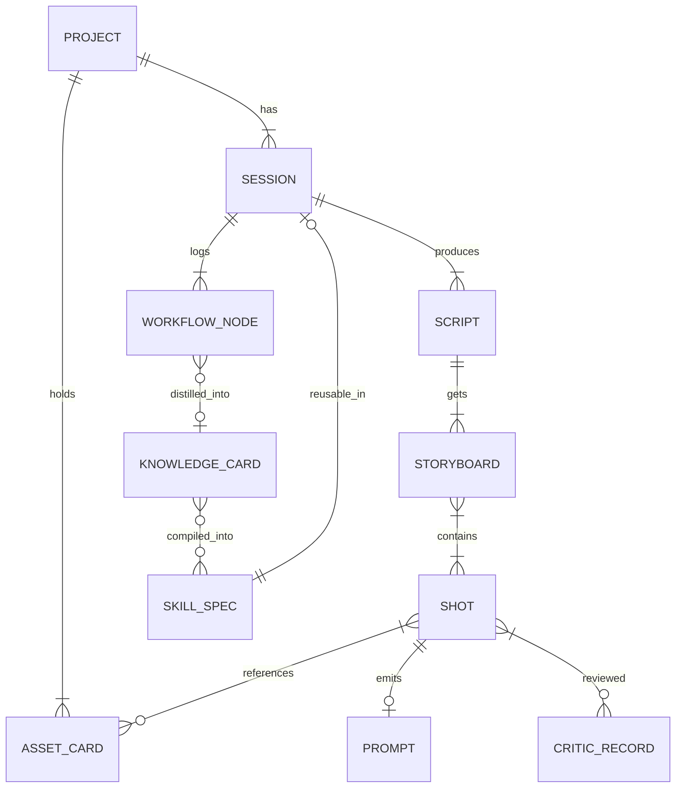
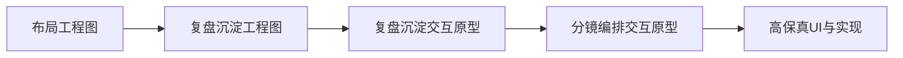
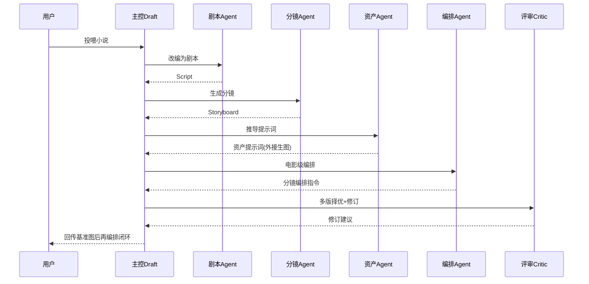

# 影视编导策划智能体 · 综合技术文档

> **文档版本**：v1.0　**编制日期**：2026-09-21　**文档状态**：方案定稿（待进入实现）
> **文档性质**：本文件整合了此前所有可行性评估、技术架构、UI/UX 设计图纸与复盘沉淀技术方案，形成唯一权威技术基线。

---

## 目录

- [1. 文档说明](#1-文档说明)
- [2. 产品愿景与定位](#2-产品愿景与定位)
- [3. 可行性结论与开源对标](#3-可行性结论与开源对标)
- [4. 产品功能总览](#4-产品功能总览)
- [5. 系统总体架构](#5-系统总体架构)
- [6. 技术选型](#6-技术选型)
- [7. 核心数据模型与关系图](#7-核心数据模型与关系图)
- [8. 多 Agent 工作流编排](#8-多-agent-工作流编排)
- [9. 外部 API 接入层](#9-外部-api-接入层)
- [10. 能力提升与训练闭环](#10-能力提升与训练闭环)
- [11. 桌面端 UI/UX 设计](#11-桌面端-uiux-设计)
- [12. 复盘沉淀功能](#12-复盘沉淀功能)
- [13. 代码开发规范](#13-代码开发规范)
- [14. 推荐项目结构](#14-推荐项目结构)
- [15. 开发里程碑](#15-开发里程碑)
- [16. 风险与对策](#16-风险与对策)
- [附录 A · 设计图稿索引](#附录-a--设计图稿索引)

---

## 1. 文档说明

### 1.1 文档背景
本项目的目标是开发一款**「影视编导策划智能体」**——既能完成「小说 → 剧本 → 分镜脚本 → 电影级分镜编排」的专业创作链路，又能以**桌面应用**形态提供类似「Codex」的对话窗口与可视化工作台，并通过评审、复盘沉淀与可投喂训练实现**能力自增强**。

### 1.2 本文档地位
| 原文档 | 状态 | 在本文件中 |
|--------|------|-----------|
| 《开发可行性分析评估报告》 | 已评审 | 合并为 3 / 4 章 |
| 《类似 Codex 桌面应用评估报告》 | 已评审 | 合并为 2 / 5 章 |
| 《桌面应用技术架构设计图》 | 已制作 | 合并为 5 章核心 |
| 《布局工程图 / 复盘沉淀工程图 / 交互原型》 | 已制作 | 合并为 11 / 12 章并索引 |
| 《复盘沉淀功能技术方案》 | 已评审 | 合并为 12 章 |

### 1.3 阅读对象
产品、前端、后端、LLM/算法、QA 工程师，以及项目决策者。符号约定：`代码` 为标识符/Schema 字段；🧩 表示设计决策；⚠️ 表示风险提示。

---

## 2. 产品愿景与定位

### 2.1 一句话定位
> 一款**只做「导演与策划智慧」**的智能体——它把小说改编成剧本、剧本拆成分镜、再由分镜推导**精确生图/生视频提示词**，并把基准图回传完成**电影级分镜编排**；同时以桌面化对话工作台交付，通过评审复盘与可投喂训练持续进化。

### 2.2 核心差异化
多数组件开源项目（ArcReel、Story Claw、ViMax 等）追求「一键到成片」。本产品**刻意停在「策划与提示词/编排」层**，把生图/生视频交给外部工具。这带来三个优势：

1. **更轻更聚焦** —— 系统做「专业编导能力」，不做通用渲染器。
2. **更强的专业壁垒** —— 能产出行内认可的镜头语汇、越轴修正、叙事节奏，这才是护城河。
3. **模型无关** —— 生图生视频全走外部 API，端侧无需重资源，利于私有化与快速迭代。

### 2.3 目标用户与场景
- 短剧/微短剧/动漫分镜师、编导策划、编剧。
- AI 内容生产团队：需要批量产出「结构严谨、风格一致」的分镜脚本与提示词。
- 影视教育/研究：作为镜头语言与叙事手法的分析教学助手。

---

## 3. 可行性结论与开源对标

### 3.1 可行性结论
**完全可执行**，且不属从零发明——生态已具备成熟基础设施与多个可复用范式。能力维度分级如下：

| 能力 | 成熟度 | 落点 |
|------|--------|------|
| 剧本改编（小说→剧本） | ✅ 成熟 | DSR 双阶段解耦；剧本 YAML/Schema |
| 分镜脚本 + 镜头语言 | ✅ 成熟偏半 | 分镜 JSON + 领域知识库 |
| 资产提示词推导（角色/场景/道具/服饰） | ✅ 成熟 | 文本提示词推导，不生成图（差异化点） |
| 基准图回传→再编排 | ✅ 成熟 | IP-Adapter / ControlNet / Qwen 参考图 |
| 电影级编排（构图/景别/运镜/色彩/叙事/配音） | ⚠️ 半成熟 | 编排知识库 + 镜头语汇提示词库，需人工把关 |
| 持续训练自进化 | ✅ 可行（须受控） | RAG 即时层 + 定期 LoRA/DPO 权重层 |

### 3.2 开源生态对标（GitHub 等）
| 项目 | 方向 | 可复用能力 |
|------|------|-----------|
| **ArcReel**（4.2k★） | AI 短剧工作台，小说→成片 | 6 阶段 Agent 编排、角色/场景/道具资产库、11 家 100+ 模型供应商协议 |
| **Story Claw**（ZC89757） | 小说→分镜图管线 | 编剧改编→结构化解析→分镜渲染，`panels_*.json` 分镜结构 |
| **Toonflow** | AI 短剧，角色一致性 | 分镜提示词细化前中后景/角色动态/道具布局 |
| **ViMax**（港大，1万+★） | 想法→成片 | 5 智能体编排、RAG 全局语境、图结构视觉一致性、Quality Control Agent |
| **ScripterAgent**（腾讯） | 对话→电影级剧本 | 两阶段训练（SFT+RL），Director/Critic Agent 评审基准 |
| **DSR**（阿里） | 剧本生成解耦 | 双阶段解耦（创意→格式转换），75% 胜率超 Gemini-2.5-Pro |
| **Novel2Script** | 小说转剧本 | 标准化剧本 Schema、增量迭代修改、版本管理 |

> **启示**：借鉴开源范式，但明确「策划层」定位，避免陷入「生成成片」的重型同质竞争。

---

## 4. 产品功能总览

### 4.1 功能全景（四大模块）
| 模块 | 能力 | 交付物 |
|------|------|--------|
| 剧本改编 | 小说→分场剧本 | 结构化剧本（场景/对白/动作/角色卡/情感标记） |
| 分镜脚本 | 剧本→镜头列表 | 分镜 JSON（景别/运镜/构图/叙事） |
| 提示词推导 | 分镜→精确提示词 | 角色/场景/道具/服饰文本提示词（不生成图） |
| 分镜编排 | →电影级分镜 | 构图/景别/运镜/色彩/镜头叙事/配音全维指令 |
| 评审 / 迭代 | Critic 择优+修订 | 修订建议 + 基准图一致性复核 |
| 复盘沉淀 | 对话→知识→Skill | 知识卡片 + Skill 封装 + 复用闭环 |

### 4.2 工作台（桌面端)可视化操作
- 分镜画布（时间轴 + 镜头卡片）
- 资产图库与基准图上传/对比
- 评审面板
- 底部工具流 Dock 分类导航

---

## 5. 系统总体架构

### 5.1 架构分层图
```
┌─────────────────────────────────────────────────────────┐
│ ① 表现层（桌面 UI · Tauri2 + 系统WebView + React/TS）   │
│   ├─ 对话窗口（左中）       ├─ 分镜工作台（时间轴/镜头） │
│   ├─ 资产·基准图区（右）    ├─ 评审·设置面板           │
│   └─ 复盘沉淀中心（独立窗口）                            │
├─────────────────────────────────────────────────────────┤
│ ② Agent 核心（本地 Rust 服务层）                        │
│   ├─ 多 Agent 编排器（剧本/分镜/提示词/编排/评审）       │
│   ├─ Agent 循环·沙箱：Tool-call · 上下文管理 · RAG记忆  │
│   ├─ 执行日志（WorkflowNode 落库）                      │
└─ 结构化输出（分镜 JSON / 提示词 / Skill）               │
├─────────────────────────────────────────────────────────┤
│ ③ 工具与数据层（本地可调）                              │
│   ├─ 剧本/分镜/资产 Schema 读写校验                     │
│   ├─ SQLite 持久化（项目/会话/评审/训练样本）           │
│   └─ 向量库（sqlite-vec/lance） + 资产图库             │
├─────────────────────────────────────────────────────────┤
│ ④ 外部接入层（供应商适配 · 可插拔）                     │
│   ├─ 国内 LLM   ├─ 生图       ├─ 生视频      ├─ TTS     │
│   └─ 统一供应商协议 + 自定义端点（支持本地 vLLM/Ollama）│
└─────────────────────────────────────────────────────────┘
     能力提升闭环：采纳/评审样本 → 定期微调 → Evals 回归 → 受控迭代
```

### 5.2 层职责
| 层 | 职责 | 关键原则 |
|----|------|----------|
| 表现层 | 用户交互、拖拽上传、流式回显 | 渲染层不接触凭证；仅经 IPC 调 Rust |
| Agent 核心 | 决策、编排、工具调度、上下文 | 核心业务逻辑在 Rust；敏感操作沙箱隔离 |
| 工具与数据层 | 文件、资产、Schema、持久化 | 本地优先，支持私有化 |
| 外部接入层 | 封装多供应商生成能力 | 泛化接口，Agent 只按语义选工具不绑厂商 |

---

## 6. 技术选型

### 6.1 桌面壳选型对比
| 方案 | 安装包 | 内存(6窗口) | 后端 | 结论 |
|------|--------|------------|------|------|
| **Tauri 2（推荐）** | 8.6MB | ~172MB | Rust 原生，安全隔离 | 跨平台轻量、可私有化、可承载 Agent 工具层 |
| Electron | 244MB | ~409MB | Node+Chromium | 重 UI 生态，但臃肿，不适配本地轻量 Agent |
| Python GUI | 大/中 | 高 | Python | 配 Python 生态顺手，跨端分发弱 |

🧩 **决策**：采用 **Tauri 2**。理由：Rust 适合承载安全的多 Agent 工具层（文件/凭证/命令/沙箱）；系统 WebView 体积小、内存省；官方插件（fs/dialog/shell/store/updater/sql）全覆盖。

### 6.2 前端栈
- **框架**：React + TypeScript（或 Vue 3 + TS，二选一，建议与本团队技术偏好一致）。
- **状态管理**：Zustand / Pinia；**构建**：Vite。
- **可视化**：分镜时间轴（自定义 Canvas 或 `react-zoom-pan-pinch`）、提示词卡渲染。

### 6.3 后端 / Agent 栈
- **后端**：Rust（Tauri 命令层）+ 可选 `tokio` 异步。
- **Agent 编排**：可先以 JS/TS 原型验证，M2 后续再以 Rust 固化敏感工具。
- **编排框架参考**：支持多 Agent 的框架（如 LangGraph、CrewAI）仅在服务端/原型期使用，端侧以自研编排器为主，减少重依赖。

### 6.4 LLM / 向量 / 微调
- **LLM 接入**：国内通义（DashScope）/ 豆包（火山方舟）/ DeepSeek / Kimi（OpenAI 兼容或各家 SDK）。
- **向量**：`sqlite-vec` / `lance`（随包）；大规模可 `Qdrant`。
- **嵌入**：`text-embedding-v3` / `BGE-M3`，多模态加 `CLIP`。
- **微调**：LlamaFactory / Unsloth / Axolotl（LoRA/QLoRA + SFT/DPO/GRPO）。

---

## 7. 核心数据模型与关系图

### 7.1 领域核心概念
- **剧本(Script)**：分场结构，含角色卡/场景/对白/情感标记。
- **分镜(Storyboard)**：镜头列表，每个镜头含景别/运镜/构图/叙事字段。
- **资产卡(AssetCard)**：角色/场景/道具/服饰的稳定外貌定义（防精分的第一道闸）。
- **工作流节点(WorkflowNode)**：一次 Agent 工具调用/产物溯源。
- **知识卡片(KnowledgeCard)**：一次复盘的单个技能点（可沉淀）。
- **Skill 规格(SkillSpec)**：可对外复用的封装单元。

### 7.2 ER 关系示意


### 7.3 关键实体 Schema（示例）

**剧本片段（Script）**
```jsonc
{
  "script_id": "sc_001",
  "title": "夜航",
  "scenes": [
    {
      "scene_no": 3,
      "location": "船舱甲板",
      "time": "夜",
      "beats": [
        { "type": "action|dialogue", "speaker": "船长", "text": "……", "emotion": "压抑" }
      ],
      "intent": "揭示船长内心的动摇"
    }
  ]
}
```

**镜头（Shot）**
```jsonc
{
  "shot_id": "st_0302",
  "scene": 3,
  "goal": "渲染孤寂",
  "shot_type": "over_shoulder",       // 景别/机位
  "camera": { "height": "eye", "move": "dolly-in", "lens": "50mm" },
  "composition": "三分法，主体置于右1/3",
  "color": "冷蓝+暖高光对比",
  "narrative": "慢节奏，动机前置",
  "voice": "小型弦乐铺底"
}
```

**知识卡片（KnowledgeCard）**——详见第 12 章。
**WorkflowNode / SkillSpec**——见第 12 章。

### 7.4 关系图（交互原型与工程图的关系）


---

## 8. 多 Agent 工作流编排

### 8.1 Agent 清单（Actor / Critic 架构）
| Agent | 角色 | 输入 | 输出 | 关键能力 |
|-------|------|------|------|----------|
| 主控 Draft | 任务分发 | 用户意图 | Agent 调度计划 | 分支规划、上下文路由 |
| 剧本改编 Agent | 小说→剧本 | 原文 | 分场剧本(Script) | 双阶段解耦（创意→格式），情感标记 |
| 分镜脚本 Agent | 剧本→镜头 | Script | 分镜(Storyboard) | 镜头意图、结构化 JSON |
| 资产提示词 Agent | 提示词推导 | 剧本/镜头 | 角色/场景/道具/服饰提示词 | 精确 API 提示词（不生成图） |
| 分镜编排 Agent | 电影级编排 | 分镜+资产 | 构图/景别/运镜/色彩/叙事/配音指令 | 镜头语汇知识库 |
| 评审 Critic Agent | 择优+修订 | 多版分镜 | 评分+可落地修订建议 | 与导演 Agent 对抗式 |
| 配音音效顾问 Agent（可选） | 音效设计 | 分镜 | 对白节奏/音效/配乐指令 | 补充成片感 |

### 8.2 主链路编排（简化序列）


### 8.3 关键一致性策略（防"角色精分"）
1. **资产库先行**：先建角色/场景/道具三类资产卡，所有分镜基于资产卡生成（ArcReel/Story Claw 验证范式）。
2. **参考图条件控制**：IP-Adapter（外观）、ControlNet（姿态/深度/构图）、StoryMaker（服装/发型/体型整体一致）、LoRA（风格/角色）。
3. **上下文管理**：`事件 → 场景 → 镜头` 三级递归分解 + RAG 全局语境，解决长篇上下文爆炸（ViMax 验证）。

### 8.4 上下文预算
每个 Agent 会话维护 token 预算；分镜头向量引用只取相关上下文片段。上下文未命中时回退到全量剧本概要。

---

## 9. 外部 API 接入层

### 9.1 供应商适配（AI 外接）
| 能力 | 可选供应方 |
|------|-----------|
| LLM | 通义(DashScope)、豆包(火山方舟)、DeepSeek、Kimi（OpenAI 兼容或各家 SDK） |
| 生图 | Seedream、通义万相、FLUX、GPT-Image |
| 生视频 | Seedance、可灵、Vidu、Sora、Veo |
| TTS 配音 | 各家云 TTS |

### 9.2 协议抽象
统一供应商协议 + 自定义端点，支持本地 `Ollama` / `vLLM`。Agent 只按语义选择能力，不绑定厂商（对标 ArcReel 的 11 家 100+ 模型适配）。
```jsonc
// provider.yaml
providers:
  llm:
    - { id: qwen, base: "https://dashscope.aliyuncs.com/...", routed: true }
    - { id: deepseek, base: "https://api.deepseek.com/...", routed: true }
  image:
    - { id: seedream, routed: true }
  video:
    - { id: seedance, routed: true }
```

### 9.3 接入规范
- key 存系统 Keychain，Rust 侧透传，不进入渲染层。
- 统一错误码与降级提示（限流/欠费/网络）。
- 生成结果落本地资产库，可用作后续基准图。

---

## 10. 能力提升与训练闭环

采用三层递进，是系统护城河。

| 层次 | 机制 | 作用 | 迭代速度 |
|------|------|------|---------|
| 短期·记忆层 | 评审结果+采纳/拒绝进向量库(RAG) | 零样本沉淀偏好/范式/规避点 | 即时生效 |
| 中期·权重层 | LoRA/QLoRA + SFT/DPO，定期重训 | 记忆升级为内化能力 | 按版本触发 |
| 长期·规范层 | Schema 版本 + 提示词库 + 评审清单 | 三处同源演进 | 版本化发布 |

**受控边界**（防漂移）：
1. 不做无监督实时自训（成本/漂移/版权）；改"脚本/训练师定期采集 → 人工抽样把关 → 批量重训 → A/B 回归"。
2. 评审者也要被评审：加元评审 / Evals 回归集，防"越评越松/苛刻"。
3. 评审不只打分：让 Critic 输出**可落地修订指令**而非只给分数。
4. 采纳闭环为数据：每次接受/拒绝/改对应一个打分差异样本。

> 训练闭环与第 12 章复盘沉淀共享同一基准（`user_verdict === accepted` 样本优先）。

---

## 11. 桌面端 UI/UX 设计

### 11.1 定位
「类似 Codex 的桌面应用智能体」：本地文件/资产、可后台重任务、可视化分镜画布、支持拖拽文件与图片上传。相比纯 Web，更贴合导演工作流。

### 11.2 整体布局（左中右三位一体 + 底部工具流 Dock）
```
┌──────────────────────────────────────────────────────────────────┐
│ 顶栏 H=58：品牌 · 项目切换 · 模型供应商(通义Qwen) · 账户           │
├──────────┬───────────────────────────────┬────────────────────────┤
│ 左栏W=250│ 中栏（弹性）                   │ 右栏 W=392(可拖宽)     │
│ ┌───────┐│ ┌───────────────────────────┐ │ ┌───────────────────┐ │
│ │七步导航││ │ 对话窗口                  │ │ │ 影视工作台         │ │
│ │①剧本改编││ │  · 阶段标签 / RAG状态     │ │ │  · 分镜画布(时间轴)│ │
│ │②分镜  ││ │  · 消息气泡 / 工具流式回显 │ │ │  · 镜头卡片        │ │
│ │③提示词││ │  · 输入条[拖拽文件/图片]   │ │ │  · 资产卡 / 基准图  │ │
│ │④编排  ││ └───────────────────────────┘ │ │  · 提示词卡        │ │
│ │⑤配音  ││                               │ └───────────────────┘ │
│ │⑥评审  ││                               │ ┌─── 底部工具流Dock ──┐│
│ └───────┘│                               │ │ 资产|镜头|编排|评审|配音││
│ 会话集合  │                               │ └────────────────────┘│
│ 设置·供应商│                               │                        │
│ ·训练·沉淀│                               │                        │
├──────────┴───────────────────────────────┴────────────────────────┤
│ 复盘沉淀中心入口（独立窗口，见 11.6）                              │
└──────────────────────────────────────────────────────────────────┘
```

### 11.3 已交付的工程图稿（具体设计稿见附录 A）
1. 《影视编导桌面应用-布局工程图.html》——左中右三位一体线框稿，含尺寸标注与区域编号表（A-01/ L-01/ M-01/ R-01/ R-02）。
2. 《影视编导桌面智能体-复盘沉淀中心.html》——独立窗口线框稿（STEP01 总结 → STEP02 提炼 → STEP03 沉淀&封装）三步流程条。
3. 《复盘沉淀中心-交互原型.html》——可操作高保真原型（见第 12 章）。

### 11.4 UI 视觉基调（建议）
- **方向**：深色石墨底 + 胶片琥珀点缀 + 克制的品牌紫，走"专业影视/剪辑台"观感；区别于通用浅色 AI 界面。
- **组件**：镜头卡片、时间轴、资产卡、提示词卡、状态徽标（已沉淀/待复核/待定版/已封装）。

### 11.5 待确认设计决策
1. 视觉基调：深色专业叙事风 vs 浅色清爽风。
2. Dock 位置：右栏工作台底部（当前）vs 横贯应用底部全局。
3. 左栏是否可折叠以放大画布。

### 11.6 复盘沉淀中心（独立窗口交互）
三步流程条 + 左侧技能点卡片列表 + 右侧卡片详情 + 底部批量沉淀/一键封装 Skill（详见第 12 章及交互原型）。

---

## 12. 复盘沉淀功能

### 12.1 功能定位
将一次成功的对话/工作流经验沉淀为可复用能力：
```
对话记录 → 知识卡片(多技能点) → 工作流知识库 → 一键封装 Skill → 会话复用
```

### 12.2 三个关键数据模型

**WorkflowNode（工作流执行节点）**——由 Agent 执行日志自动落库，支撑"一键总结"。
```jsonc
{
  "node_id": "wf_8f2c1a", "session_id": "sess_0312", "type": "tool_call",
  "agent": "storyboard_agent", "tool": "storyboard_updater",
  "args_snapshot": { "scene": 3 }, "produced_artifacts": ["art_ff1"],
  "result_status": "applied", "user_verdict": "accepted", "ts": 1752120000000
}
```

**KnowledgeCard（知识卡片，一技能一点，多张组成一次复盘）**
```jsonc
{
  "card_id": "kc_09", "skill_point": "分镜脚本优化",
  "origin": { "sessions": ["sess_0312"], "summary": "按三情拆分分镜的优化过程" },
  "trigger": "分镜需按情绪拆分",
  "interface": { "inputs": ["剧本段落","分镜JSON"], "outputs": ["优化分镜","提示词"] },
  "steps": [ { "order": 1, "action": "解析剧本段落", "tool": "解析器" } ],
  "prompt_template": "按\"铺垫/冲突/释放\"三段切分……",
  "best_practices": ["情绪转折点拍慢"],
  "metrics": { "regression_stability": "3/3", "reuse_count": 0 },
  "state": "drafted"   // drafted | saved | packaged
}
```

**SkillSpec（Skill 封装，可对外调用）**
```jsonc
{
  "skill": {
    "name": "storyboard-optimize", "description": "按情绪拆分分镜时复用……",
    "version": "1.0.0", "source_cardId": "kc_09",
    "workflow": [ { "step": "parse", "agent": "script_parser" },
                  { "step": "split_by_emotion", "agent": "storyboard_agent" } ],
    "entry_trigger": "/workflow:storyboard-optimize",
    "prompts": { "template": "……", "variables": ["分镜JSON"] }
  }
}
```

### 12.3 四步处理管线
| 阶段 | 处理 |
|------|------|
| PHASE 1 · 总结 | 还原 WorkflowNode 序列 → LLM 归纳操作流程/工具链/产物 |
| PHASE 2 · 提炼 | 按技能点拆分为 n 张 KnowledgeCard（schema 约束 + few-shot），人工可编辑 |
| PHASE 3 · 沉淀 | vector 入库(RAG) + SQLite 关系 + 样本归档 |
| PHASE 4 · 封装 | 回归达标或人工确认 → 编译 SkillSpec → 写 skills/ 目录，会话内一键调用 |

### 12.4 库存复用技术
hybrid(BM25+向量) 检索、复用入口 `/workflow:<skill>`、`reuse_count` 淘汰低效卡。

### 12.5 集成闭环
Skill 复用 → 新一轮 WorkflowNode 日志 → 可再次被复盘 → 能力增强引擎。相关风险缓解见 16.3。

---

## 13. 代码开发规范

### 13.1 语言与命名
| 关注点 | 规范 |
|--------|------|
| 语言 | 前端 TS(严格模式)，后端 Rust(edition 2021，`--deny warnings` 交付) |
| JS/TS 命名 | 变量/函数 `camelCase`；组件/类 `PascalCase`；常量 `UPPER_SNAKE` |
| Rust 命名 | 结构体/枚举 `PascalCase`，函数/变量 `snake_case`，常量 `SCREAMING_SNAKE`，模块 `snake_case` |
| 文件命名 | React 组件 `PascalCase.tsx`；hook `useXxx.ts`；Schema `*.schema.json` |

### 13.2 目录结构
- 前端 `src/`：`components/`、`features/`、`services/`、`state/`、`assets/`。
- Rust `src-tauri/`：`commands`、`agents`、`repo`(数据)、`providers`、`sandbox`、`errors`。

### 13.3 注释与文档
- 公共 API 用 JSDoc/Rustdoc；注释只解释"为什么"，不解释"是什么"。
- 每个 Schema 变更需同步更新本技术文档第 7、12 章。

### 13.4 Git 规范
- 分支：`feat/*`、`fix/*`、`docs/*`；PR 需通过 CI lint + 类型检查。
- commit 遵循 Conventional Commits（`feat:`、`fix:`、`docs:`、`refactor:`）。

### 13.5 错误处理与安全性
- Rust 侧处理文件/网络/凭证；错误统一映射到 UI 可读文案 + 错误码。
- 凭证只存 OS Keychain，禁入渲染层；外部输入走 schema 校验后再进 Agent 上下文。

### 13.6 多 Agent 与可观测
- 所有 Tool-call 落 `WorkflowNode` 日志（埋点即第 12 章数据源）。
- 提供结构化 log（session_id、agent、tool、verdict）便于复盘与训练采样。

### 13.7 测试要求
- Schema 校验单测；Agent 输出 mock 后断言结构与收敛性。
- 关键链路（剧本→分镜→提示词→编排）设 Evals 回归用例，回归不通过不得封装 Skill。

---

## 14. 推荐项目结构

```
film-director-agent/
├─ src-tauri/                 # Rust 后端(Tauri 2)
│  ├─ commands/               # Tauri IPC 命令
│  ├─ agents/                 # 多 Agent 编排器(剧本/分镜/资产/编排/评审)
│  ├─ repo/                   # SQLite + 向量读写
│  ├─ providers/              # 外部 API 供应商适配层
│  ├─ sandbox/                # 沙箱文件/凭证/命令
│  ├─ errors/                 # 统一错误
│  └─ Cargo.toml
├─ src/                       # 前端 React+TS(Vite)
│  ├─ features/
│  │  ├─ chat/ dashboard/ review/ reflect/ settings/
│  ├─ components/ services/ state/ assets/
├─ skills/                    # Skill 资产库(编译产物)
├─ schemas/                   # 剧本/分镜/资产/知识卡/SkillSpec schema
├─ evals/                     # 回归测试集(剧本→分镜→提示词→编排)
├─ design/                    # 本技术文档 + 工程图(见附录A)
└─ README.md
```

---

## 15. 开发里程碑

| 阶段 | 内容 | 关键交付 |
|------|------|---------|
| **P0 基础骨架** | Tauri2+React 工程、统一架构、剧本 Schema、LLM 接入 | 小说→剧本走通 |
| **P1 核心流水线** | 剧本→分镜→提示词三 Agent + 资产库 | 一集→分镜脚本+精确提示词可出图 |
| **P2 编排+评审** | 编排 Agent + Critic Agent + 反馈采集 | 基准图回传→再编排闭环 |
| **P3 训练闭环** | RAG 记忆 + 定期 LoRA/DPO + Evals | 系统随投喂能力可见提升 |

复用复盘沉淀的排序：**M1 数据层 → M2 提炼管线(风险集中，优先验证) → M3 封装复用 → M4 闭环增强**。

---

## 16. 风险与对策

### 16.1 业务/合规风险
| 风险 | 对策 |
|------|------|
| 版权(小说改编/AI生图) | 素材授权；生图外包合规 API |
| 一致性漂移(角色精分) | 资产库先行 + 参考图条件控制 |
| 长篇上下文爆炸 | 事件/场景/镜头三级分解 + RAG 分段 |
| "电影级"预期落差 | 定位为专业策划/导演助手，非全自动成片 |

### 16.2 工程风险
| 风险 | 对策 |
|------|------|
| 图像工作区 UI 复杂 | 分阶段：先列表/卡片，再时间轴 |
| Rust 学习成本 | 前端先 JS 原型，敏感工具再 Rust 固化 |
| 供应商 API 变化 | 适配层抽象 + 降级提示 |

### 16.3 训练/复盘沉淀风险
| 风险 | 对策 |
|------|------|
| 评审自我漂移 | 元评审 + Evals 回归集（见 10 章） |
| Skill 自动封装误用 | 回归达标或人工确认 + 版本 diff |
| 知识库膨胀 | TTL/LRU 淘汰 + 向量去重归并 |
| 训练样本污染 | 仅归档 `accepted` 样本，人工修订优先 |

---

## 附录 A · 设计图稿索引

| 文件 | 类型 | 说明 |
|------|------|------|
| `复盘沉淀中心-交互原型.html` | 交互原型 | 可操作高保真原型（切换/沉淀/封装/Toast） |
| `影视编导桌面应用-布局工程图.html` | 工程图 | 左中右三位一体布局线框稿 |
| `影视编导桌面智能体-复盘沉淀中心.html` | 工程图 | 独立窗口线框稿(三步流程) |
| `复盘沉淀功能-技术方案.md` | 技术方案 | 复盘沉淀底层数据流（已并入本文档第12章） |

> 预览方式：本地启动静态服务器后打开对应 html；本目录为 `design/` 统一存放处。